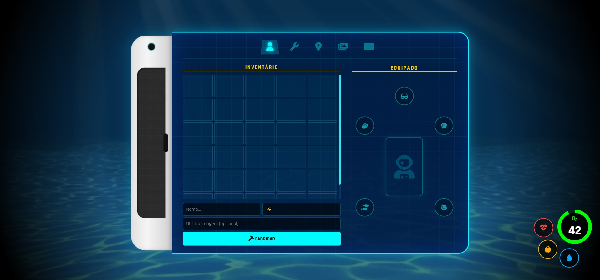

# Subnautica PDA - Fabricator System (MVC)


> Um simulador de interface do PDA do jogo *Subnautica*, desenvolvido como atividade prática de Arquitetura de Software (Model-View-Controller).


## Sobre o Projeto

Este projeto foi desenvolvido para a disciplina de **Desenvolvimento de Sistemas** do SENAI. O objetivo principal foi implementar o padrão de arquitetura **MVC (Model-View-Controller)** utilizando JavaScript puro (Vanilla JS), fugindo dos exemplos tradicionais e criando uma experiência imersiva baseada em *Game UI*.

### Funcionalidades Implementadas

* **Arquitetura MVC Rígida:** Separação clara entre Dados (Model), Interface (View) e Regras de Negócio (Controller).
* **Sistema de Fabricação:** Input de dados para criar itens que são renderizados dinamicamente no grid.
* **Drag & Drop System:** Arraste itens fabricados do inventário para equipá-los nos slots do personagem.
* **Oxygen Survival Loop:** Sistema simulado de oxigênio que diminui com o tempo, com alertas visuais e sonoros críticos.
* **Persistência de Dados:** Uso de `localStorage` para salvar o inventário mesmo após fechar o navegador.
* **UI/UX Imersivo:**
    * Animação de Boot (Inicialização do Sistema Alterra).
    * Efeito Glassmorphism (Vidro translúcido).
    * Design responsivo e fiel ao jogo original.

## Tecnologias Utilizadas

* **HTML5:** Estrutura semântica.
* **CSS3:** Animações (`keyframes`), Grid Layout, Flexbox e filtros visuais (`backdrop-filter`).
* **JavaScript (ES6+):** Lógica MVC, manipulação do DOM, Eventos de Drag/Drop e LocalStorage.
* **FontAwesome:** Ícones vetoriais.

## Estrutura MVC

Como o código foi organizado para atender aos requisitos da aula:

```javascript
// MODEL (Dados)
// Gerencia o array de itens e a comunicação com o LocalStorage.
const FabricatorModel = { ... }

// VIEW (Interface)
// Manipula o DOM, cria os elementos HTML do grid e atualiza a tela.
const FabricatorView = { ... }

// CONTROLLER (Gerente)
// Ouve os eventos (submit, click, drag), chama o Model para salvar
// e ordena a View a se atualizar.
const FabricatorController = { ... }

```

# Developed by Vinicius Montuani| SENAI Desenvolvimento de Sistemas
